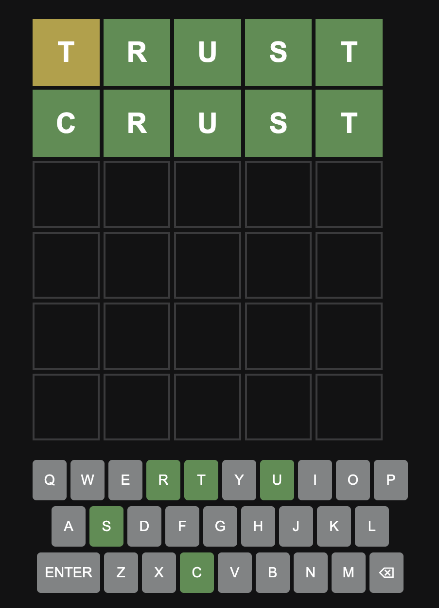

# Word Guess Game

A modern implementation of the popular word-guessing game, built with pure JavaScript (no frameworks) and Vite.



## Features

- Clean, modern user interface
- Real-time word validation
- Color-coded feedback for correct and incorrect letters
- Responsive design
- Built with pure JavaScript (no frameworks) for optimal performance

## Technologies Used

- HTML5
- CSS3
- JavaScript (ES6+) - Pure JavaScript without any frameworks
- Vite (Build tool)
- Jest (Testing framework)

## Prerequisites

- Node.js (v14 or higher)
- npm (v6 or higher)

## Installation

1. Clone the repository:
```bash
git clone https://github.com/yourusername/word-guess.git
cd word-guess
```

2. Install dependencies:
```bash
npm install
```

## Usage

### Development

To run the development server:
```bash
npm run dev
```

### Production Build

To create a production build:
```bash
npm run build
```

To preview the production build:
```bash
npm run preview
```

## Testing

Run the test suite:
```bash
npm test
```

## Project Structure

```
word-guess/
├── assets/           # Static assets (images, etc.)
├── src/
│   ├── classes/     # JavaScript classes
│   ├── tests/       # Test files
│   ├── game.js      # Main game logic
│   ├── index.html   # Main HTML file
│   └── styles.css   # Styles
├── package.json     # Project configuration
└── README.md        # This file
```

## Contributing

1. Fork the repository
2. Create your feature branch (`git checkout -b feature/AmazingFeature`)
3. Commit your changes (`git commit -m 'Add some AmazingFeature'`)
4. Push to the branch (`git push origin feature/AmazingFeature`)
5. Open a Pull Request

## License

This project is licensed under the ISC License - see the LICENSE file for details.